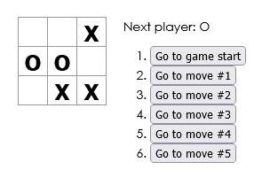

# React.js - Tic-tac-toe tutorial

This is a tutorial found in the official documentation at [Reactjs.com](https://reactjs.org/tutorial/tutorial.html). It teaches the basic functions of a react app, its file structure, and logic behind several components working together.

The project was deployed to GitHub with the help of *react-gh-pages* package. The master branch contains the app's source code (the code the app's developers edit), and the gh-pages branch contains a built version of the app (i.e. the code that GitHub Pages serves to the app's visitors).

- Live Site URL: [GitHub Pages](https://xs30snw.github.io/react-tic-tac-toe/)

## Screenshot

## Ideas for improvements

- [ ] Display the location for each move in the format (col, row) in the move history list.
- [ ] Bold the currently selected item in the move list.
- [ ] Rewrite Board to use two loops to make the squares instead of hardcoding them.
- [ ] Add a toggle button that lets you sort the moves in either ascending or descending order.
- [ ] When someone wins, highlight the three squares that caused the win.
- [ ] When no one wins, display a message about the result being a draw.